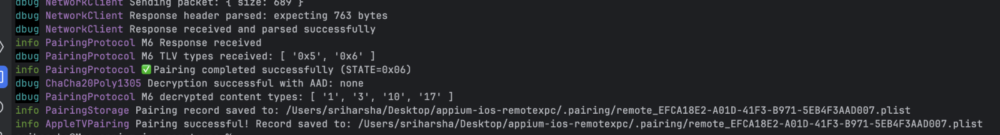

# Apple TV Pairing Instructions

This comprehensive guide will walk you through the process of pairing your Apple TV device for remote testing and automation using this project.

## Overview

Apple TV pairing establishes a secure connection between your development machine and the Apple TV device. This pairing process uses cryptographic protocols to ensure secure communication over the network. Once paired, the generated pair record allows you to create remote tunnels and execute commands on the Apple TV without requiring physical access.

## Prerequisites

Before beginning the pairing process, ensure you have:

- An Apple TV device
- A development/client machine with this project installed
- Both devices connected to the same local network
- Network connectivity between both devices (no firewall blocking)
- Node.js and npm installed on your development machine
- This project's dependencies installed (`npm install`)

## Detailed Pairing Steps

### Step 1: Ensure Same Network Connection

**Why this matters:** The Apple TV pairing protocol uses mDNS (multicast DNS) and Bonjour for device discovery. Both devices must be on the same local network segment to discover and communicate with each other.

**Instructions:**
1. On your Apple TV, navigate to **Settings → Network**
2. Note the network name (SSID) your Apple TV is connected to
3. On your development machine, verify you're connected to the same Wi-Fi network
4. Ensure both devices have valid IP addresses in the same subnet
5. Test network connectivity by pinging the Apple TV's IP address (if known)

**Troubleshooting:**
- If devices are on different VLANs, they may not discover each other
- Enterprise networks with client isolation may block peer-to-peer communication
- Some routers have "AP Isolation" enabled which prevents device communication

### Step 2: Enable Discovery Mode on Apple TV

**Why this matters:** The Apple TV must be in pairing mode to accept incoming pairing requests. This is a security feature that prevents unauthorized devices from connecting to your Apple TV.

**Instructions:**
1. On your Apple TV, use the remote to navigate to **Settings**
2. Select **Remotes and Devices**
3. Select **Remote App and Devices**
4. The Apple TV will now enter discovery mode


**What happens:** When in discovery mode, the Apple TV broadcasts its availability via Bonjour/mDNS services on the network. The device advertises specific service types that allow pairing clients to discover it.

**Important notes:**
- The Apple TV will remain in discovery mode for a limited time
- You'll see a list of devices trying to connect

### Step 3: Run the Pairing Command

**Why this matters:** This command initiates the pairing protocol client on your development machine, which will discover the Apple TV, establish a connection, and begin the cryptographic handshake process.

**Instructions:**

From your project's root directory in the terminal, execute:

```bash
npm run pair-appletv
```

**What this command does:**
- Starts the device discovery service using Bonjour/mDNS
- Searches for Apple TV devices on the local network
- Lists available Apple TV devices found
- Initiates the pairing protocol with the selected device
- Prepares to receive and verify the pairing PIN

**Expected output:**
```
Discovering Apple TV devices...
Found devices:
  1. Living Room Apple TV (192.168.1.100)
  2. Bedroom Apple TV (192.168.1.101)

Select device to pair: 1
Initiating pairing with Living Room Apple TV...
Waiting for PIN code...
Enter the 4-digit PIN displayed on your Apple TV:
```

**Troubleshooting:**
- If no devices are found, verify both devices are on the same network
- Check that the Apple TV is in discovery mode (Step 2)
- Ensure your firewall isn't blocking mDNS traffic (port 5353 UDP)
- Try restarting the Apple TV and running the command again

### Step 4: Enter the Pairing PIN

**Why this matters:** The PIN verification is a critical security step that ensures you are physically present at the Apple TV and have authorized the pairing. This prevents unauthorized remote pairing attempts.

**Instructions:**

1. Look at your Apple TV screen - a 4-digit PIN code will be displayed prominently
2. The PIN is randomly generated for each pairing attempt
3. Type the PIN exactly as shown into your terminal when prompted
4. Press Enter to submit the PIN


**What happens during PIN verification:**
- Your client sends the PIN to the Apple TV
- The Apple TV verifies the PIN matches what it displayed
- If correct, the Apple TV proceeds with the cryptographic key exchange
- Both devices establish a secure, encrypted session
- The pairing protocol exchanges public keys and generates shared secrets

**Security notes:**
- Each PIN is single-use and expires after a short time
- If you enter the wrong PIN, the pairing attempt will be rejected
- You'll need to restart the process if the PIN expires or fails
- The PIN ensures that only someone with physical access can pair

**Troubleshooting:**
- If the PIN is rejected, verify you entered it correctly
- The PIN is case-sensitive (though typically numeric only)
- If the PIN disappears from the TV screen, restart from Step 2
- Network interruptions during this step will require restarting the process

### Step 5: Verify Pairing Success

**Why this matters:** Successful pairing generates a pair record containing the cryptographic credentials needed for future secure communications with the Apple TV.

**What to look for:**

After PIN verification succeeds, you should see:

```bash
PIN verified successfully!
Completing pairing handshake...
Exchanging encryption keys...
Pairing completed successfully!
Pair record saved to: .pairing
```

The pairing process generates a file in your project's root directory:

```
.pairing
```



**About the pair record:**

The `.pairing` file contains:
- **Device identifier:** Unique ID for the paired Apple TV
- **Public/private key pairs:** For establishing encrypted sessions
- **Device metadata:** Name, IP address, and other identifying information
- **Pairing credentials:** Shared secrets for authentication

**File format:** The pair record is typically stored in JSON or binary plist format and contains sensitive cryptographic material.

**Security considerations:**
- **Keep this file secure** - it allows full access to your Apple TV
- Do not commit this file to version control (it's in `.gitignore`)
- If compromised, unpair and re-pair the device
- Each pairing is unique to a specific device combination

**What you can do now:**

With a successful pairing, you can:
- Establish remote tunnel connections to the Apple TV
- Execute commands and automation scripts
- Access Apple TV services remotely over the network
- Perform testing and debugging without physical access

## Common Issues and Solutions

### Issue: No Apple TV devices found

**Solutions:**
- Verify both devices are on the same Wi-Fi network
- Disable any VPN connections on your development machine
- Check router settings for AP isolation or client isolation
- Restart the Apple TV and try again
- Ensure the Apple TV is in discovery mode (Settings → Remotes and Devices)
- Try temporarily disabling firewall on your development machine

### Issue: PIN verification fails

**Solutions:**
- Double-check you entered the correct PIN
- The PIN may have expired - restart from Step 2
- Ensure there's no network interruption during verification
- Try the pairing process again with a new PIN

### Issue: Pairing completes but no .pairing file

**Solutions:**
- Check file permissions in your project directory
- Verify you have write access to the project root
- Look for error messages in the terminal output
- Check if the file was created in a different location

### Issue: Cannot establish tunnel after pairing

**Solutions:**
- Verify the .pairing file exists and is readable
- Ensure the Apple TV is still on the same network
- The Apple TV's IP address may have changed - try pairing again
- Check that no firewall is blocking the tunnel port

## Re-pairing

If you need to pair again (e.g., after resetting the Apple TV or changing networks):

1. Delete the existing `.pairing` file
2. Follow all steps from the beginning
3. A new pair record will be generated

## Technical Details

**Protocols used:**
- **mDNS/Bonjour:** For device discovery
- **HAP (HomeKit Accessory Protocol):** Base protocol for pairing
- **SRP (Secure Remote Password):** For password-authenticated key exchange
- **Curve25519:** For key exchange
- **ChaCha20-Poly1305:** For encrypted communication

**Network requirements:**
- UDP port 5353 (mDNS)
- TCP/UDP ports for Apple TV services (varies)
- No strict NAT or firewall blocking local network traffic

## Support

If you encounter issues not covered in this guide:
- Check the project's GitHub issues
- Ensure you're using compatible Apple TV firmware
- Verify all dependencies are correctly installed
